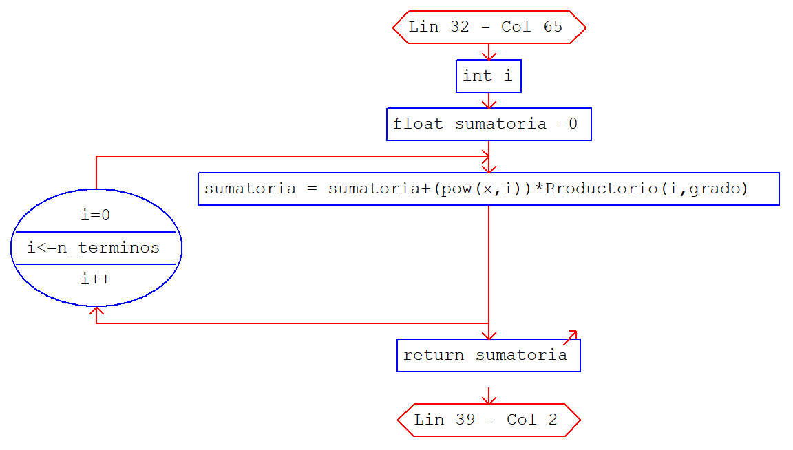

# Practica_11

<h2 align="center"> FUNCIONES </h2> <br>

### EJERCICIO 1

---

<h3 align="center"> Resolviendo </h3> <br>


#### Diagrama_de_flujo_1
> ${\color{TealBlue}\mbox{Flujograma  (funcion principal)}}$
<p align="center">
  
</p>

> ${\color{TealBlue}\mbox{Flujograma  (N terminos)}}$
<p align="center">
  
</p>

> ${\color{TealBlue}\mbox{Flujograma  (Factorial)}}$
<p align="center">
  
</p>

> ${\color{TealBlue}\mbox{Flujograma  (Sumatoria Binomial)}}$
<p align="center">
  
</p>

> ${\color{TealBlue}\mbox{Flujograma  (Productorio)}}$
<p align="center">
  
</p>

#### Codificacion_en_C_1


>
```C
#include<stdio.h>
#include<math.h>

void n_terminos(float z_0, float grado);
int factorial(int n);
float Sumatoria_binominal(float x, float grado, int n_terminos);
float Productorio(float n, float grado);

main(){
	//Fucniona pero con valores enteros de la potencia y no para radicales
	float z_0 ,dominio,potencia;
	printf("   Ingrese el valor del punto de convergencia -> ");
	scanf("%f",&z_0);
	potencia=1.0/3;
	n_terminos(z_0,potencia);
}

void n_terminos(float z_0, float grado) {
	float eva ,cont = 1;
	int cond;
	// saca el valor del nro de termino
	do {
		eva = (pow(z_0,cont))/factorial(cont)*1000000;//para 6 decimales
		cond=eva;
		cont ++;
	} while (cond!=0);
	cond=cont;
	printf("\n\t   Para %d terminos : \n",cond);
	printf("\n\n   S = %f \n",Sumatoria_binominal(z_0,grado,cont));
}

float Sumatoria_binominal(float x, float grado, int n_terminos) {
	int i;
	float sumatoria =0;
	for (i=0 ; i<=n_terminos ; i++) {
		sumatoria = sumatoria+(pow(x,i))*Productorio(i,grado);
	}
	return sumatoria;
}

float Productorio(float n, float grado) {
	int k = 1;
	float valor_producto = 1;
	if( n==0 ){
		valor_producto = 1;
	}else{
		for(k=1;k<=n;k++){
			if( n>=k ){
				valor_producto = valor_producto*((grado-k+1)/(k));
			}
		}
	}
	return valor_producto;
}

int factorial(int finn){
	float fact = 1;
	int i;
	for (i=1;i<=finn;i++){
		fact = fact*i;
	}
	return fact;
}
```

#### Ejecucion 1


> ${\color{TealBlue}\mbox{Prueba 1  (  raiz cubica de : 1.1  )}}$
<p align="center">
  
</p>

> ${\color{TealBlue}\mbox{Prueba 1  ( raiz cubica de : 1.5 )}}$
<p align="center">
  
</p>


---
#### Enunciado_2


<h3 align="center"> Resolviendo </h3> <br>

#### Diagrama_de_flujo_1

> ${\color{TealBlue}\mbox{Flujograma  (funcion principal)}}$
<p align="center">
  
</p>

> ${\color{TealBlue}\mbox{Flujograma  (comprobando datos)}}$
<p align="center">
  
</p>

> ${\color{TealBlue}\mbox{Flujograma  (Sumatoria)}}$
<p align="center">
  
</p>

> ${\color{TealBlue}\mbox{Flujograma  (Potencia)}}$
<p align="center">
  
</p>

> ${\color{TealBlue}\mbox{Flujograma  (Factorial)}}$
<p align="center">
  
</p>

#### Codificacion_en_C_2

>${\color{TealBlue}\mbox{Funcion principal}}$

```C
#include<stdio.h>

int comprobando_datos(float dato);
float sumatoria(float grados);
float potencia(float arg, float finn);
float factorial(float finn);
void enunciado();

float grado, s;

main(){
	float gra;
	enunciado();
	scanf("%f",&grado);
	gra=grado;
	if(comprobando_datos(grado)==1){
		s = sumatoria(grado);
		printf("\n\tSen(%1.2f) = %f\n",gra,s);
	}
	printf("\n\tTerminando programa ...");
}

void enunciado(){
	printf(" Sea la serie :\n");
	printf("     sin(x) = sum(i: 0->inf){ (-1)^i*x^(2i+1) / (2i+1)! }\n");
	printf(" Ingrese el valor de x (en grados sexagesimales)\n\n");
	printf("          x = ");
}

int comprobando_datos(float conv){
	if(conv>=0 && conv<=360){
		grado=conv*17453.29252*0.000001;//convirtiendo en radianes
		return 1;
	}else{
		printf("\n\tValor invalido");
		return 0;
	}
}

float sumatoria(float grados){
	int i,cont=0;
	float signo=-1, sum = 0, eva;
	//contando con 6 decimales para n-terminos
	do{
		eva=potencia(grados,2*cont+1)/factorial(2*cont+1)*1000000;
		i=eva;
		cont++;
	}while(i>0);
	printf("\n");
	for (i=0;i<cont;i++){
		signo = -1.0*signo;
		sum = sum+(signo*potencia(grados,2*i+1))/factorial(2*i+1);
		printf("\tT_%d = %4.6f\n",i,(signo*potencia(grados,2*i+1))/factorial(2*i+1));
	}
	return sum;
}

float potencia(float arg, float finn){
	int i;
	float pot = 1;
	for (i=1;i<=finn;i++){
		pot = pot*arg;
	}
	return pot;
}

float factorial(float finn){
	float fact = 1;
	int i;
	for (i=1;i<=finn;i++){
		fact = fact*i;
	}
	return fact;
}
```

#### Ejecucion_2

> ${\color{TealBlue}\mbox{Prueba 1 ( sen 70 )}}$
<p align="center">
  
</p>

> ${\color{TealBlue}\mbox{Prueba 2  ( sen 92 )}}$
<p align="center">
  
</p>

---
#### Enunciado_3

---

<h3 align="center"> Resolviendo </h3> <br>

#### Diagrama_de_flujo_3

> ${\color{TealBlue}\mbox{Flujograma  (funcion principal)}}$
<p align="center">
  
</p>

> ${\color{TealBlue}\mbox{Flujograma  (Terminos)}}$
<p align="center">
  
</p>

> ${\color{TealBlue}\mbox{Flujograma  (termino n simo)}}$
<p align="center">
  
</p>

#### Codificacion_en_C_3

```C
# include <stdio.h>

void Terminos(int ini, int fin);
int Term_n_simo(int);

main(){
	int n;
	printf(" \n\t *   RECURSIVIDAD EN C++   *");
	printf(" \n\t   ________________________");
	printf(" \n\t Ingrese la cantidad de terminos" );
	printf(" \n\t\t*-> ");
	scanf("%d",&n);
	printf("\n\t-Sea la serie de fibonacci :\n\n");
	Terminos(1,n);
}


void Terminos(int cont, int n){//cont -> 1,2,3,4,5,...,n
	if(cont<=n){
		printf("\t[%d]",Term_n_simo(cont));
		if(cont%3!=0){
			if(cont!=n)
				printf("\t->\t");		
			else
				printf(".");		
		}
		else
			printf("\n");	
		return Terminos(cont+1,n);
	}
}

int Term_n_simo(int n){
	if(n==1||n==2){
		return 1;	}
	return Term_n_simo(n-1)+Term_n_simo(n-2);
}
```


#### Ejecucion_3

> ${\color{TealBlue}\mbox{Prueba 1 ( 12 terminos )}}$
<p align="center">
  
</p>

> ${\color{TealBlue}\mbox{Prueba 2  ( 25 terminos )}}$
<p align="center">
  
</p>


